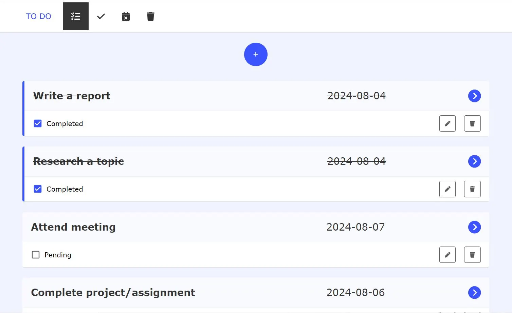

<h1><a id='top'>TO DO app</a></h1>

**TO DO** A TO DO app is a tool for creating and managing tasks.

## Features

- **Task Creation:** Users can add new tasks with titles and descriptions.
- **Task Completion:** Users can mark tasks as completed.
- **Task Removal:** Users can delete tasks.
- **Task Restoration:** Users can recover deleted tasks from the trash.
- **Task Editing:** Users can modify task titles, descriptions, and deadlines.
- **Task Details:** Each task includes a title, description, and deadline.
- **Task Overdue:** The app indicates tasks that are past their deadline.
- **Completed Tasks:** Users can view a list of completed tasks.
- **Task Trash:** Deleted tasks are moved to a trash bin for potential recovery.

## Dependencies

- **reduxjs/toolkit**
- **mui**
- **formik**
- **yup**
- **typescript**
- **react-router-dom**
- **date-io**

## To run this application, you'll need the following software installed on your system:

- **Git:** Ensure you have Git installed on your system. You can download it from https://git-scm.com/downloads.
- **Node.js and npm:** These are essential for managing JavaScript dependencies in the project. You can download and install them from the official Node.js website: https://nodejs.org/

## To run this application follow these steps

1. **Clone this repository:**
   git clone [https://github.com/manevardazaryan1/todo-list]

2. **Navigate to the project directory:**
    Navigate to the project folder(cd [project folder name])

3. **Install dependencies:**
    npm install

4. **Running the Application**
    npm start

This will typically launch the application in your default web browser, usually at http://localhost:3000 (the port may vary). You can then interact with the app and see its functionality in action.

[Tap to Top ⬆](#top)